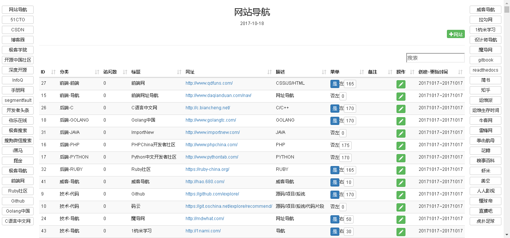

# MySiteNav
My website navigation

（我的网站导航）

目的用于平时快速浏览网站，可自定义常用网站，在一个页面内快速浏览内容，比使用浏览器标签方便

## Function

（功能）
- 自带常用技术网站
- 个人学习网站，快速浏览
- 可记录查看次数
- 可添加编辑网站
- 可自定义排序
- 可定义常用网站悬浮于左右页面
- 快速搜索功能

## Install

（安装）
1. 创建库，默认库名nav
2. 导入表结构，db/nav.sql
3. 修改$DB_CONFIG数据库配置

## Usage

（使用方法）
- 方式1，下载源码，直接点击start.bat运行，默认打开chrome浏览器访问
- 方式2，下载源码，浏览器运行nav.php

## Author

Email: 24xinhui@163.com